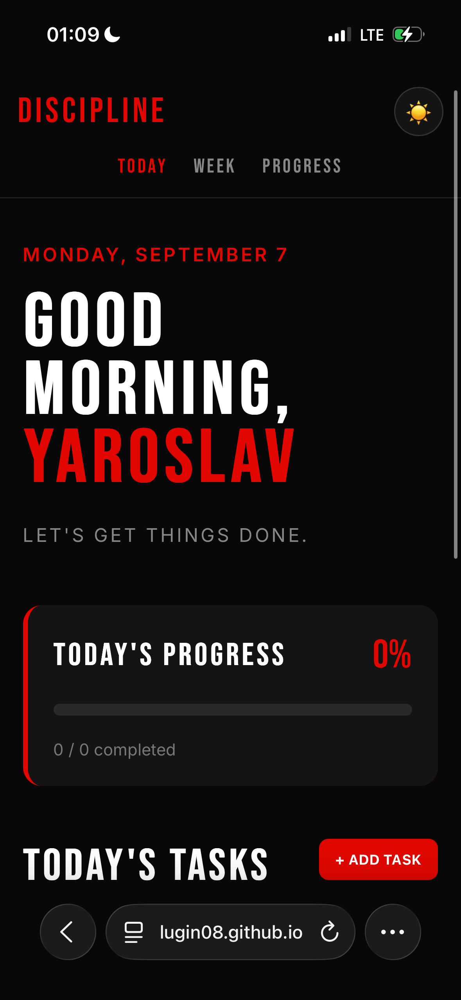
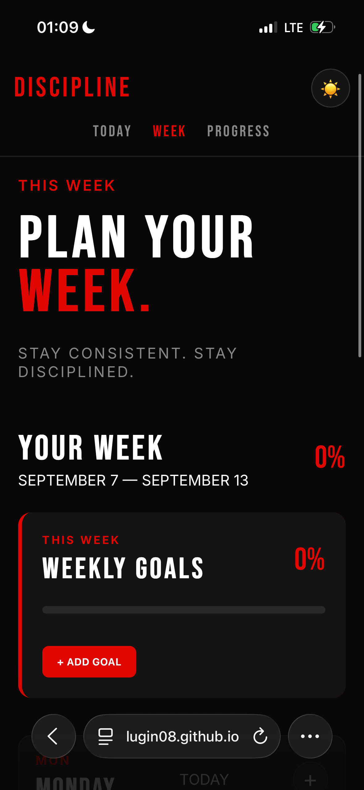
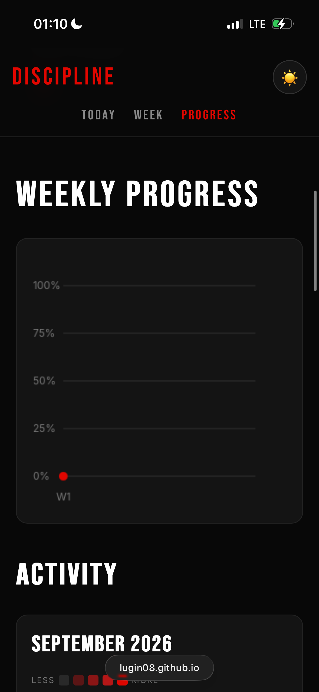
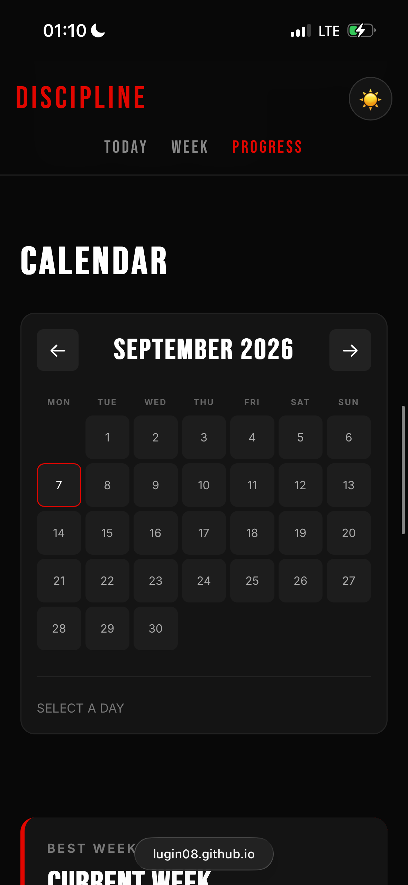

<div align="center">

# 🔴 WEEKLY TRACKER

### Plan. Track. Improve.

A responsive productivity tracker built from scratch with  
**HTML, CSS and JavaScript.**

[🚀 Live Demo](https://lugin08.github.io/WEEK-PLANNER/)

</div>

---

## ✨ Features

| 📋 Productivity | 📊 Progress | 🎨 Experience |
|---|---|---|
| Daily tasks | Progress statistics | Dark / Light mode |
| Weekly planner | Progress graph | Responsive design |
| Weekly goals | Streak system | Clean UI |
| Daily notes | Activity calendar | Mobile friendly |
| 7 separate days | Achievement system | LocalStorage |

---

## 📸 Screenshots

### TODAY

Your daily tasks, progress and personal notes.



---

### WEEK

Plan every day of your week and create weekly goals.



---

### PROGRESS

Track your long-term progress with statistics and graphs.



---

### CALENDAR

See your activity and completed tasks across the month.



---

## 🛠️ Built With

- **HTML5** — structure
- **CSS3** — design and responsive layout
- **JavaScript** — application logic
- **LocalStorage** — saving user data
- **Canvas API** — progress graph
- **GitHub Pages** — deployment

---

## 📱 Responsive Design

Weekly Tracker is designed to work across:

- 💻 Desktop
- 💻 Laptop
- 📱 Mobile
- 📲 Tablet

---

## 🎯 Project Goal

I built Weekly Tracker from scratch to practice front-end development and create a useful productivity tool.

The project focuses on:

- JavaScript logic
- Local data storage
- Responsive web design
- User experience
- Data visualization
- Building a complete project from scratch

---

## 📂 Project Structure

```text
WEEK-PLANNER/
│
├── index.html
├── product.html
├── week.html
├── progress.html
├── style.css
├── script.js
└── README.md
